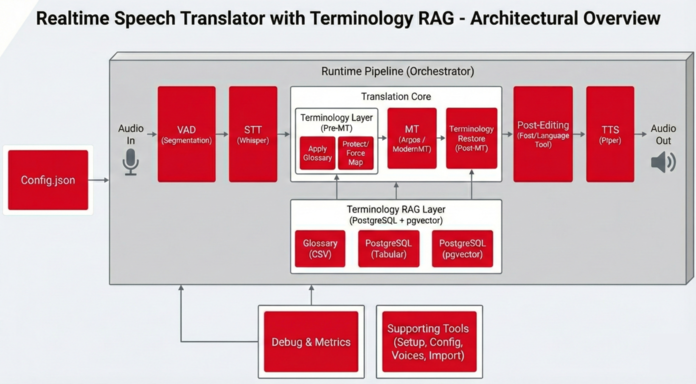

# Realtime Speech Translator (Offline) with Terminology RAG (Postgres + pgvector)

This repository contains an end-to-end prototype for near real-time speech translation with **offline-first** execution, **domain terminology enforcement**, and an optional **vector-based terminology retriever** built on **PostgreSQL + pgvector**.

The system records audio from a microphone, detects speech segments, transcribes locally, applies terminology rules, translates, post-edits for grammatical quality (while preserving glossary constraints), and speaks the final output via local TTS.

## Key Features

* **Near real-time, segment-based pipeline**

  * Continuous microphone capture
  * Robust speech segmentation via VAD
  * Segment-by-segment processing to keep latency predictable

* **Offline Speech-to-Text (STT)**

  * Local transcription using `faster-whisper` (WhisperModel)
  * Deterministic settings for reproducible results

* **Machine Translation (MT) backends**

  * **Argos Translate** (offline)
  * **ModernMT** (optional HTTP endpoint)
  * Controlled via configuration (`mt.backend`, `mt.src_lang`, `mt.tgt_lang`)

* **Terminology enforcement layer**

  * Applies curated railway terminology before translation and restores/protects terms after translation
  * Two terminology policies:

    * `protect`: terms must never be changed
    * `force`: terms may be inflected only under strict, safe rules

* **Terminology storage options (RAG backends)**

  * `glossary`: CSV-based term list
  * `postgres`: classic SQL term store (loads terms for a language direction)
  * `postgres_vector`: vector similarity search using **pgvector**

    * Retrieves Top-K candidate terms for each segment via semantic embeddings
    * Reduces per-segment runtime cost compared to applying a full list

* **Post-editing (quality layer)**

  * `fast`: deterministic heuristics only (very low overhead)
  * `full`: LanguageTool grammar correction with strict glossary protection
  * Ensures `protected_terms` are never changed; `inflectable_terms` only get safe suffix edits

* **Offline Text-to-Speech (TTS)**

  * Local synthesis using **Piper** voices
  * Voice management helper to list/install voices

* **Developer tooling**

  * Interactive **Config Editor** for `config.json`
  * One-click **Terminology import** into Postgres/pgvector (batch-based, Windows friendly)
  * Setup and launcher CMD scripts for quick local testing

## Architecture Overview

Runtime pipeline (high level):

1. **Audio In** (`sounddevice`)
2. **Voice Activity Detection** (`webrtcvad`) → speech segments
3. **STT** (`faster-whisper`) → text
4. **Terminology Layer** (apply glossary / retrieve terms)
5. **MT** (Argos or ModernMT)
6. **Terminology Restore / Term Protection**
7. **Post-Edit** (deterministic + optional LanguageTool)
8. **TTS** (Piper) → **Audio Out**

Each segment logs timing for performance tuning (STT, glossary/RAG, MT, post-edit, TTS).

## Configuration

The application is **config-driven**. By default it reads `config.json` from the orchestrator folder. You can override the config path using:

* `OEBB_CONFIG=/path/to/config.json`

Important config sections (conceptual):

* `audio`: device selection and sample rate
* `vad`: aggressiveness and segmentation thresholds
* `stt`: Whisper model + compute options
* `mt`: backend selection and language direction
* `rag`: terminology backend selection and DB/CSV settings
* `postedit`: mode (`fast`/`full`) and language
* `tts`: Piper voice and output paths

### Selecting a terminology backend

Set:

* `rag.backend = "glossary" | "postgres" | "postgres_vector"`

For DB modes, `rag.pg_dsn` points to the Postgres DSN.

## Terminology Database (Postgres + pgvector)

The vector terminology mode uses a `public.glossary_terms` table that stores:

* language direction (`src_lang`, `tgt_lang`)
* term pair (`src_term`, `tgt_term`)
* policy (`mode`, `priority`)
* metadata (`meta` JSONB)
* embedding (`embedding vector(384)`)

Embeddings are typically produced with:

* `sentence-transformers/paraphrase-multilingual-MiniLM-L12-v2` (384 dims)

An ANN index can be created via HNSW (preferred) or IVFFLAT (fallback).

## Setup (Windows)

The repository includes helper CMD scripts:

* `setup.cmd` — creates/activates `.venv`, installs dependencies, performs sanity import checks
* `setup_postgres.cmd` — one-click installer postgres & the used database tables
* `setup_terminology.cmd` — one-click terminology import (of sample data) into Postgres/pgvector
* `edit_config.cmd` — runs the interactive config editor
* `voice_manager.cmd` — starts the Piper voice manager to install and manage voices
*  `run.cmd` (launcher) — starts the realtime app

Depending on your environment you may also need:

* Docker Desktop (for local Postgres/pgvector)
* Piper voices in `services/tts/voices/`
* Argos language packages (for offline MT)

## Adding More Languages

The system is designed to be extendable to additional language pairs (e.g. DE↔EN, DE↔HU, DE↔CS, DE↔IT), provided that:

* STT language configuration is set appropriately
* the chosen MT backend supports the language pair
* a TTS voice exists for the target language
* terminology is available for the language direction and imported into the DB

## Project Status

This is a working prototype focused on:

* offline capability
* deterministic behavior where possible
* maintainable, config-driven architecture

The setup tooling is still being finalized and does not yet install every external dependency end-to-end.

## License / Notes

Internal prototype codebase. Validate licenses for external models and third-party dependencies (Whisper, Argos, LanguageTool, Piper voices) before production use.
